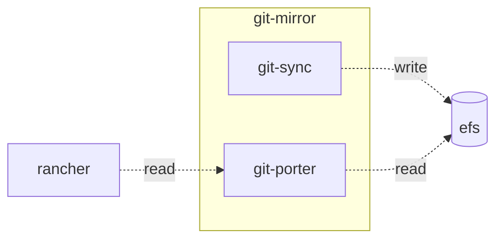

# git-mirror

Mirror git repositories.

## Architecture

```mermaid
flowchart LR
  git-sync
  shared-storage[(efs)]
  git-porter
  rancher

  git-sync -. write .-> shared-storage
  git-porter -. read .-> shared-storage
  rancher -. read .-> git-porter

  subgraph git-mirror
    git-sync
    git-porter
  end
```

